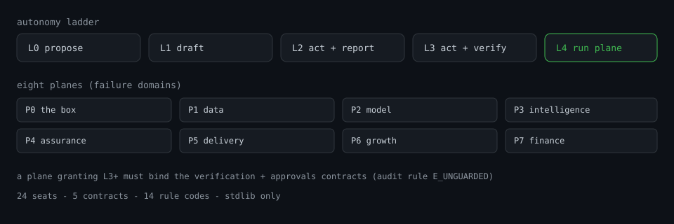
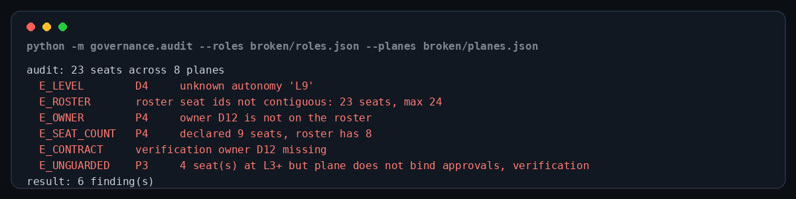
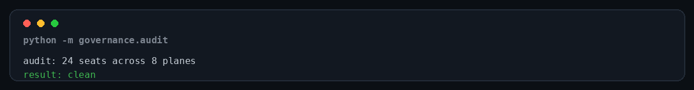
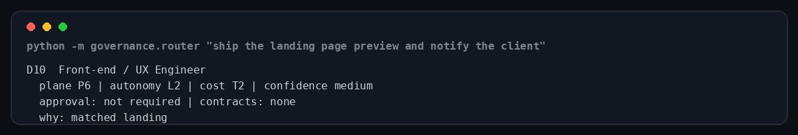
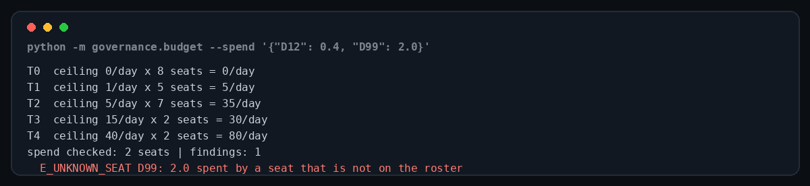
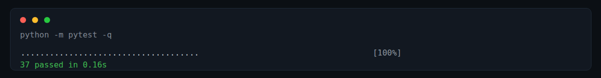
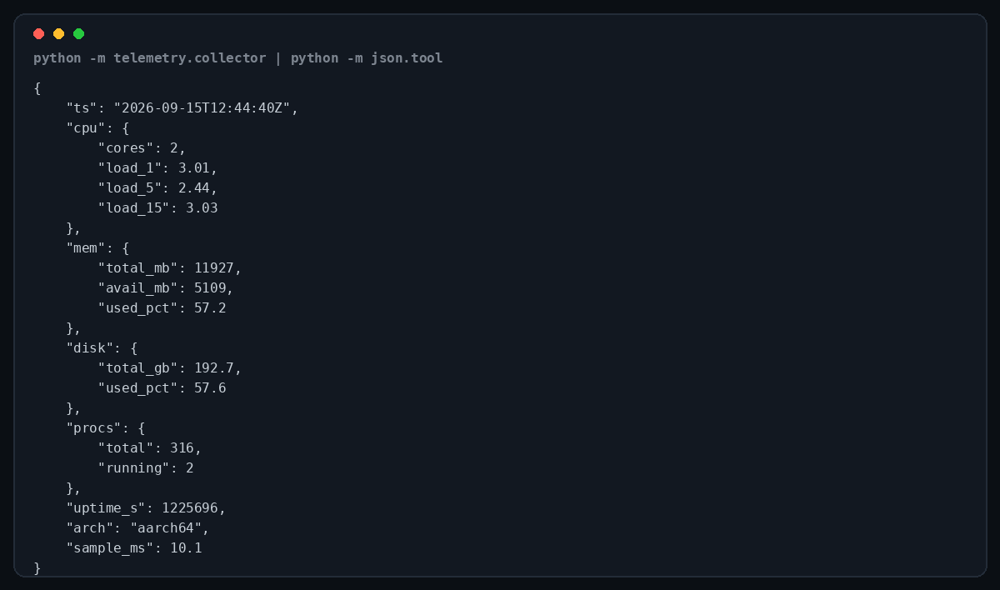
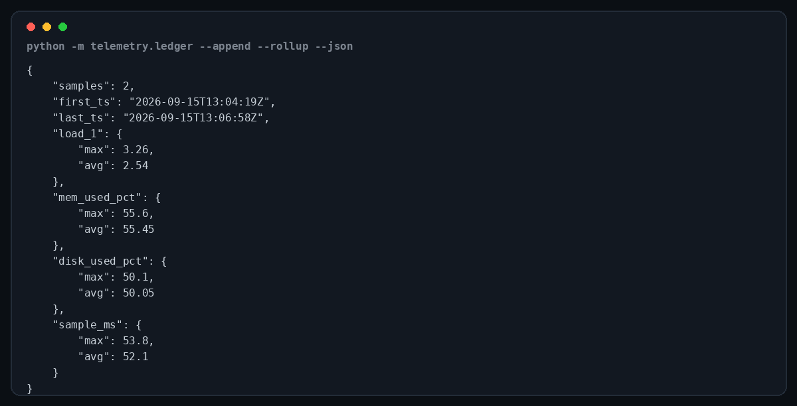
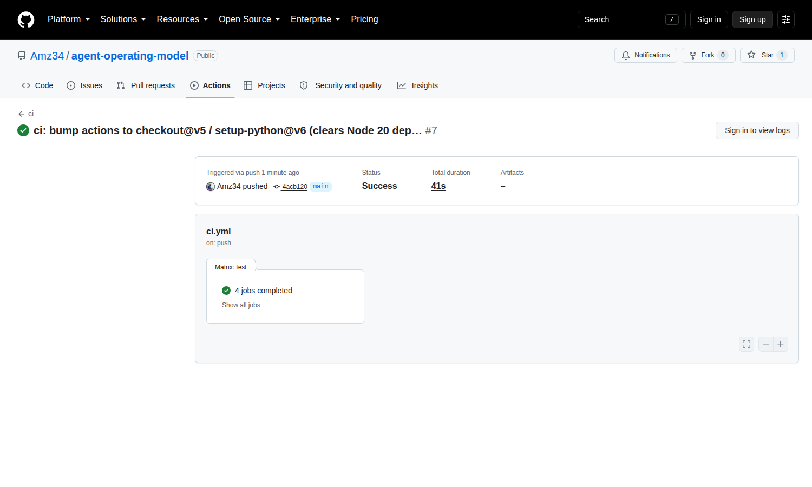

# Agent Operating Model

**One box. 24 named seats. 8 planes. Nobody owns "everything".**

[](https://github.com/Amz34/agent-operating-model/actions/workflows/ci.yml)
[](#verified-numbers)
[](#verified-numbers)
[](#quickstart)
[](#quickstart)
[](LICENSE)
[](#fork-it-and-make-it-yours)

Role specifications, the multi-plane contract layout, a task router and the auditors that keep a
governed multi-agent organisation honest — the part that normally stays in someone's head until it
breaks.

## What this is - and what it is not

| This is | This is not |
|---|---|
| an org chart + rulebook your agents are measured against, as checkable data | an agent framework - nothing here runs your agents |
| four small standard-library tools that read and check that data | a hosted service, a database, or a UI |
| a router that decides **which seat owns a task**, plus the gate for when it needs approval | an executor: the router returns a plan, it does not take the action |
| an auditor that fails a build when the model breaks its own rules | a runtime, a scheduler, or an LLM wrapper |
| a spec another team's system can be measured against | something that needs a model call to work |

**In one line:** this is the paperwork a multi-agent system needs before it is allowed to act - with
the paperwork machine-checked instead of aspirational.

### Plain-English glossary

| Term | Plain meaning | Where it lives |
|---|---|---|
| **seat** | one accountable job in the fleet - a role like "Deploy Engineer", not a person and not a process | `roles/roles.json` |
| **plane** | a failure domain: if it breaks, that part of the org stops | `planes/planes.json` |
| **contract** | a guarantee one seat owns and the planes must honour (verification, approvals, security, deploy, telemetry) | `planes/planes.json` |
| **autonomy level** (L0-L4) | how much a seat may do before a human approves - from "inform only" to "fully owns the plane" | `governance/levels.json` |
| **cost tier** (T0-T4) | the daily spend ceiling for the seat's tier, checked against real spend | `roles/roles.json` |



## The problem

Hand a model a shell and tasks get done. Run forty of them in parallel and you get the failures
everyone hits in week two:

- nobody can say **which seat** should have owned a task;
- autonomy gets granted by accident — a prompt tweak turns "draft this" into "deploy this";
- the one agent that verifies work belongs to the same chain that produced it;
- cost tiers exist in a spreadsheet and nothing reads them;
- you cannot answer *"was it slow, or was it wrong?"* because nothing samples the box.

This repo is the boring scaffolding that removes those five. It is not a framework: it is data plus
four small standard-library tools, so it drops into whatever runtime you already use.

## What's inside

| Path | What it is |
|---|---|
| `roles/roles.json` | 24 seat specifications: id, title, tier, plane, autonomy level, cost tier, mandate, routing signals — plus a daily ceiling per cost tier |
| `planes/planes.json` | 8 planes (P0–P7) + the **contract layout**: which seat owns each fleet-wide contract, and which contracts each plane binds |
| `governance/levels.json` | the L0–L4 autonomy ladder in plain language, plus the escalation ladder |
| `governance/audit.py` | the auditor: 14 rule codes over the whole model, non-zero exit on any finding |
| `governance/router.py` | task → seat, with the approval gate and the plane's contracts attached |
| `governance/budget.py` | per-tier cost ceilings and spend findings |
| `telemetry/collector.py` | one host sample: load, memory, disk, process pressure, uptime → flat JSON |
| `telemetry/ledger.py` | those samples over time: rollups and threshold alerts |
| `docs/design.md` | why the model looks like this (three decisions carry the rest) |
| `tests/` | 37 tests: the model passes its own rules, every rule fires when violated, and routing cannot false-positive on substrings |

## Quickstart

```bash
git clone https://github.com/Amz34/agent-operating-model
cd agent-operating-model

python -m governance.audit          # 24 seats across 8 planes -> result: clean
python -m governance.router "rotate the API key and tell the client"
python -m governance.budget         # per-tier ceilings and allowances
python -m telemetry.collector       # one sample, ~10 ms
python -m pytest -q                 # 37 passed
```

Nothing to install: Python 3.11+ and the standard library. Dev tooling is one line —
`python -m pip install -e ".[dev]"` — which also installs the console scripts `aom-audit`,
`aom-route`, `aom-budget`, `aom-telemetry` and `aom-ledger`.

## The router: one task, one accountable seat

Ask "which agent should own this?" in a review and you should get an answer, not a debate. The
router scores every seat's declared `signals` against the task text — deterministically, no
embeddings, no model call — and returns the seat with its autonomy level, cost tier, approval gate
and the contracts its plane binds.

```bash
$ python -m governance.router "rotate the API key and tell the client"
D3  Client Delivery Manager
  plane P5 | autonomy L2 | cost T1 | confidence low
  approval: not required | contracts: approvals, verification
  why: matched client
```

Nothing matched? The router refuses to guess: it falls back to the triage seat, marks the plan
`unrouted: true`, and `--strict` turns that into a non-zero exit code — the behaviour you want in a
pipeline.

## Cost is a contract too

A cost tier that nothing reads is decoration. `roles.json` declares a daily ceiling per tier, and
`governance/budget.py` compares one day of spend per seat against the ceiling of the tier that seat
sits on:

```bash
$ python -m governance.budget --spend '{"D12": 0.4, "D99": 2.0}'
T0  ceiling 0/day x 8 seats = 0/day
T1  ceiling 1/day x 5 seats = 5/day
T2  ceiling 5/day x 7 seats = 35/day
T3  ceiling 15/day x 2 seats = 30/day
T4  ceiling 40/day x 2 seats = 80/day
spend checked: 2 seats | findings: 1
  E_UNKNOWN_SEAT D99: 2.0 spent by a seat that is not on the roster
```

`E_OVER_BUDGET`, `E_NO_CEILING` and `E_UNKNOWN_SEAT` each exit non-zero, so "we found out from the
invoice" stops being the process.

## The ledger: was it slow, or was it wrong?

The collector answers *how is the box now*. The ledger answers *has it been getting worse*:
append-only JSONL, tolerant reader, rollups and threshold alerts, no database.

```bash
python -m telemetry.ledger --path fleet.jsonl --append   # sample once and append it
python -m telemetry.ledger --path fleet.jsonl --rollup   # worst load, memory, disk, sample cost
python -m telemetry.ledger --path fleet.jsonl --alerts   # exit 1 when a threshold is breached
```

## The contract layout (the part people get wrong)

A contract is not a document. It is a **seat that owns a guarantee**, and planes that must honour it.
The layout shipped here binds five:

| Contract | Owner | Guarantee |
|---|---|---|
| `verification` | D12 | a verdict from a seat outside the producing chain |
| `approvals` | D21 | the human checkpoint and the rollback path |
| `security` | D13 | secrets, redaction, injection defence |
| `deploy` | D5 | preview first, production only after |
| `telemetry` | D24 | per-seat SLO and cost attribution |

Any plane granting **L3 or higher** must bind `verification` **and** `approvals`. That is enforced by
`E_UNGUARDED` in the auditor — not by a paragraph in a wiki that nobody reads at 2am. Break it on
purpose and the build stops:



## Autonomy ladder

| Level | Name | What the agent may do |
|---|---|---|
| `L0` | human-decides | inform only |
| `L1` | ai-advises | analyse and propose; a human performs the action |
| `L2` | ai-recommends | draft and prepare artefacts; a human reviews and applies |
| `L3` | agent-with-approval | execute end-to-end behind an approval checkpoint + mandatory verification |
| `L4` | agent-owned | full ownership inside a measured envelope, with rollback |

Escalation when something looks wrong: self-check → one retry → verification seat → approval queue →
chief of staff → owner (L0 only).

## Audit rules

Each rule is a failure we hit for real, not a hypothetical:

| Code | Catches |
|---|---|
| `E_DUP_ID` / `E_ROSTER` | two seats sharing an id, or a roster with a hole in it |
| `E_PLANE` / `E_LEVEL` / `E_COST` | a seat pointing at a plane, autonomy level or cost tier that does not exist |
| `E_MANDATE` | a mandate too thin to enforce |
| `E_EMPTY_PLANE` / `E_OWNER` / `E_SEAT_COUNT` | a plane with no seat, or an owner who is not on the roster |
| `E_CONTRACT` | a contract whose owner seat was deleted |
| `E_UNGUARDED` | L3+ granted on a plane that binds no guardrail contract |
| `E_SCHEMA` / `E_NO_BUDGET` | a model that drifted from its declared version, or a tier with no ceiling |
| `E_LADDER` | an autonomy ladder with no escalation path |

```bash
python -m governance.audit --json     # machine-readable report for CI
python -m governance.audit --roles my-org/roles.json --planes my-org/planes.json
```

## Verified numbers

| Claim | How to check it |
|---|---|
| 24 seats, 8 planes, 5 autonomy levels, 14 rule codes | `python -m governance.audit` |
| 37 tests pass | `python -m pytest -q` |
| 94% coverage | `python -m pytest --cov=governance --cov=telemetry` |
| Lint clean (ruff: E, F, I, ISC, UP, B) | `python -m ruff check .` |
| CI green on Linux 3.11/3.12 + macOS + Windows | the badge above |
| The model passes its own rules | `test_shipped_model_is_clean` |
| Sampling costs ~10 ms | the `sample_ms` field on any record |

## Proof of life

Every screenshot below is a real capture of this repo's own commands on one small cloud box — no
mockups.

**A clean roster** — `python -m governance.audit`:



**Routing a task** — `python -m governance.router "ship the landing page preview and notify the client"`:



**Cost findings** — `python -m governance.budget --spend '{"D12": 0.4, "D99": 2.0}'`:



**The suite** — `python -m pytest -q`:



**One telemetry sample** — `python -m telemetry.collector | python -m json.tool` (note what is *not*
in there: no hostname, no user, nothing that identifies the box):



**The same samples over time** — `python -m telemetry.ledger --append --rollup --json`:



**CI** — GitHub Actions, Linux 3.11/3.12 + macOS + Windows:



## Roadmap (the honest part)

What is missing is not more prose, it is more machine-checkable state:

1. **A JSON Schema for `roles.json`** — so an editor catches a typo'd plane before CI does.
2. **A GitHub Action** that audits any PR touching a roster and comments the findings inline.
3. **`--strict` and `--baseline` on the auditor** — treat warnings as errors, and let a fleet adopt
   new rules without a red build on day one.
4. **Per-seat SLOs** — the telemetry contract exists, the numbers do not. That is the next file.
5. **A spend ledger** — `budget.py` checks a day of spend, but nothing yet *records* it per seat.

If you fork this, those five are the highest-leverage pulls.

## Fork it and make it yours

The valuable part is not the roster, it is that the roster is **checkable**. Fork this and:

1. **Rewrite `roles/roles.json` for your own org.** Keep ids contiguous, keep autonomy honest. The
   auditor tells you what you broke.
2. **Add a contract** (e.g. `privacy`, `rollback`, `data-retention`) and bind it to the planes that
   need it.
3. **Point the ledger at your fleet** — 30-second ticks on a free-tier box cost ~10 ms each.
4. **PR the audit rule you wish existed.** Rule + failing test + one paragraph is a complete
   contribution, and the most useful kind of issue to open here.

## How I use it

This model runs a 24-seat organisation on one 2-OCPU free-tier box: every task has one owner, every
write has a gate, and the ledger is what the autonomy levels get calibrated against. When a plane
starts missing its SLO, the fix is a role change — not a new framework.

If you want this wired into your own setup, that is the work I do; the model here is free and stays
free (MIT). Open an issue describing your fleet and I will tell you which two planes to fix first.

## License

MIT — see [LICENSE](LICENSE). Changes by release are in [CHANGELOG.md](CHANGELOG.md).
